# [G0 - Team Name] Report

The following is a report template to help your team successfully provide all the details necessary for your report in a structured and organised manner. Please give a straightforward and concise report that best demonstrates your project. Note that a good report will give a better impression of your project to the reviewers.

Note that you should have removed ALL TEMPLATE/INSTRUCTION textes in your submission (like the current sentence), otherwise it hampers the professionality in your documentation.

*Here are some tips to write a good report:*

* `Bullet points` are allowed and strongly encouraged for this report. Try to summarise and list the highlights of your project (rather than give long paragraphs).*

* *Try to create `diagrams` for parts that could greatly benefit from it.*

* *Try to make your report `well structured`, which is easier for the reviewers to capture the necessary information.*

*We give instructions enclosed in square brackets [...] and examples for each sections to demonstrate what are expected for your project report. Note that they only provide part of the skeleton and your description should be more content-rich. Quick references about markdown by [CommonMark](https://commonmark.org/help/)*

## Table of Contents

1. [Team Members and Roles](#team-members-and-roles)
2. [Summary of Individual Contributions](#summary-of-individual-contributions)
3. [Application Description](#application-description)
4. [Application UML](#application-uml)
5. [Application Design and Decisions](#application-design-and-decisions)
6. [Summary of Known Errors and Bugs](#summary-of-known-errors-and-bugs)
7. [Testing Summary](#testing-summary)
8. [Implemented Features](#implemented-features)
9. [Team Meetings](#team-meetings)
10. [Conflict Resolution Protocol](#conflict-resolution-protocol)

## Administrative
- Firebase Repository Link: <insert-link-to-firebase-repository>
   - Confirm: I have already added comp21006442@gmail.com as a Developer to the Firebase project prior to due date.
- Two user accounts for markers' access are usable on the app's APK (do not change the username and password unless there are exceptional circumstances. Note that they are not real e-mail addresses in use):
   - Username: comp2100@anu.edu.au	Password: comp2100
   - Username: comp6442@anu.edu.au	Password: comp6442

## Team Members and Roles
The key area(s) of responsibilities for each member

| UID      |      Name      | Role |
|:---------|:--------------:|----------------------------------------------------------------------------------------------------------------------------------------------------------------------------------------------------------------------------------:|
| u7760022 |   Xinyang Li   | Backend (Login, DataFiles, LoadShowData, DataStream, Search-Invalid, FB-Auth, FB-Persist-extension, Register) |
| u7752874 |   Xinlei Wen   | Backend (LoadShowData, Search, Data-Formats)                                                                                                    [role] |
| u7754676 | Tashia Tamara  | Backend (Login, Search-Filter, Data-GPS)
| u7759982 | Jiangbei Zhang | Frontend (Login, Data-Profile, Register)                                                                                                                                               [role] |
| u7693070 |  Changlai Sun  | Frontend (LoadShowData, Search-Filter)                                                                                                                                                                                     [role] |

## Summary of Individual Contributions

Specific details of individual contribution of each member to the project.

Each team member is responsible for writing **their own subsection**.

A generic summary will not be acceptable and may result in a significant lose of marks.

*[Summarise the contributions made by each member to the project, e.g. code implementation, code design, UI design, report writing, etc.]*

*[Code Implementation. Which features did you implement? Which classes or methods was each member involved in? Provide an approximate proportion in pecentage of the contribution of each member to the whole code implementation, e.g. 30%.]*

*you should ALSO provide links to the specified classes and/or functions*
Note that the core criteria of contribution is based on `code contribution` (the technical developing of the App).

*Here is an example: (Note that you should remove the entire section (e.g. "others") if it is not applicable)*

1. **UID1, Name1**  I have 30% contribution, as follows:  
  - **Code Contribution in the final App**
    - Feature A1, A2, A3 - class Dummy: [Dummy.java](https://gitlab.cecs.anu.edu.au/comp2100/group-project/ga-23s2/-/blob/main/items/media/_examples/Dummy.java)
    - XYZ Design Pattern -  class AnotherClass: [functionOne()](https://gitlab.cecs.anu.edu.au/comp2100/group-project/ga-23s2/-/blob/main/items/media/_examples/Dummy.java#L22-43), [function2()](the-URL)
    - ... (any other contribution in the code, including UI and data files) ... [Student class](../src/path/to/class/Student.java), ..., etc.*, [LanguageTranslator class](../src/path/to/class/LanguageTranslator.java): function1(), function2(), ...   

  - **Code and App Design** 
    - [What design patterns, data structures, did the involved member propose?]*
    - [UI Design. Specify what design did the involved member propose? What tools were used for the design?]*   

  - **Others**: (only if significant and significantly different from an "average contribution") 
    - [Report Writing?] [Slides preparation?]*
    - [You are welcome to provide anything that you consider as a contribution to the project or team.] e.g., APK, setups, firebase*   

2. **UID2, Name2**  I have 20% contribution, as follows:  
  - ...

3**U7759982, Jiangbei Zhang**  I have 20% contribution, as follows:  
- **Code Contribution in the final App**
    - Feature Feat 1 login, Feat 9 data Profile, Feat 4 data stream 
      - class ProfileFragment: [ProfileFragment.java](app/src/main/java/anu/cookcompass/user/ProfileFragment.java)
      - class NotificationFragment:[NotificationFragment.java](app/src/main/java/anu/cookcompass/popmsg/NotificationFragment.java)
      - class NotificationAdapter:[NotificationAdapter.java](app/src/main/java/anu/cookcompass/popmsg/NotificationAdapter.java)
    - Other UI realated java class 
      - class MainActivity [MainActivity.java](app/src/main/java/anu/cookcompass/MainActivity.java)
      - class BottomBarActivity [BotommBarActivity.java](app/src/main/java/anu/cookcompass/BottomBarActivity.java)
      - class CircleImageView [CircleImageView.java](app/src/main/java/anu/cookcompass/theme/CircleImageView.java)
      - class RegisterActivity [RegisterActivity.java](app/src/main/java/anu/cookcompass/login/RegisterActivity.java)
      - class BottomBarActivity [BottomBarActivity.java](app/src/main/java/anu/cookcompass/BottomBarActivity.java)
    -   

- **Code and App Design**
    - UI Design
      - UI design for the login page: [activity_login.xml](app/src/main/res/layout/activity_login.xml)
      - UI design for the main page: [activity_main.xml](app/src/main/res/layout/activity_main.xml)
      - UI design for the nagivation bar:[activity_navigation_bar.xml](app/src/main/res/layout/activity_navigation_bar.xml)
      - UI design for the fragment_notification page:[fragment_notification.xml](app/src/main/res/layout/fragment_notification.xml)
      - UI design for the fragment_profile page:[fragment_profile.xml](app/src/main/res/layout/fragment_profile.xml)
      - UI design for the notification_item:[notification_item.xml](app/src/main/res/layout/notification_item.xml)
      - UI design for bottom_bar_background:[bottom_bar_bg.xml](app/src/main/res/menu/bottom_bar_bg.xml)
      - UI design for profile_text background:[profile_text_background.xml](app/src/main/res/drawable/profile_text_background.xml)
      - UI design for login account icon:[baseline_account_box_24.xml](app/src/main/res/drawable/baseline_account_box_24.xml)
      - UI design for register back arrow icon:[round_arrow_back_24.xml](app/src/main/res/drawable/round_arrow_back_24.xml)
    - 
    - External resources of my UI part
      -  free for non-commercial use, CC BY "best_leeyang"
      -  free for non-commercial use, CC BY "逍剑"
      -  free for non-commercial use, CC BY "best_leeyang"
      -  free for non-commercial use, CC BY "best_leeyang"
      -   

## Application Description

*[What is your application, what does it do? Include photos or diagrams if necessary]*

CookCompass is a recipe application targeted towards people are interested in cooking. It provides thousands of recipes featuring lots of different ingredients. Users can sort the recipes based on their id number, title, likes, and views. They can also look for recipes of a certain level of popularity, for example recipes with at least 100 likes or views. 

### Application Use Cases and or Examples

*[Provide use cases and examples of people using your application. Who are the target users of your application? How do the users use your application?]*

Target users: Home cooks / People interested in cooking

* Users can use it to look up various kinds of recipes.
* Users can use the app's search feature to look up recipes by typing in keywords into the search bar.
* Users can like recipes, thereby adding to the recipe's like count.
* Every time another user of the app likes or unlikes recipes, the user will receive a notification. The user can also see which location this other user is liking/unliking the recipe from. This helps the user keep track of in which countries certain recipes are currently gaining or losing popularity. 
* Users can sort the recipe search results according to the recipe's id number, title, likes, and views.
* Users can filter the recipe search results by typing in how many top results they want (top N results) or typing in the number of results they want and with at least a certain number of likes or views (top N results with at least K likes/views).
* Users can also customize their app experience by changing their profile picture and/or changing the app's theme color.

(Keeping the section below for future reference in case we want to add this use case example)

*Here is a pet training application example*

*Molly wants to inquiry about her cat, McPurr's recent troublesome behaviour*
1. *Molly notices that McPurr has been hostile since...*
2. *She makes a post about... with the tag...*
3. *Lachlan, a vet, writes a reply to Molly's post...*
4. ...
5. *Molly gives Lachlan's reply a 'tick' response*

 

### Application UML

  
*[Replace the above with a class diagram. You can look at how we have linked an image here as an example of how you can do it too.]*

UML Subdiagrams (Based on Package):

1. 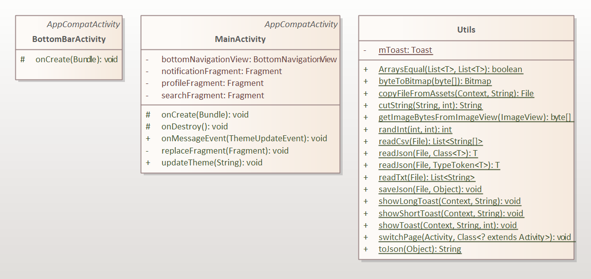  
2. 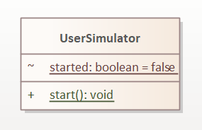  
3. 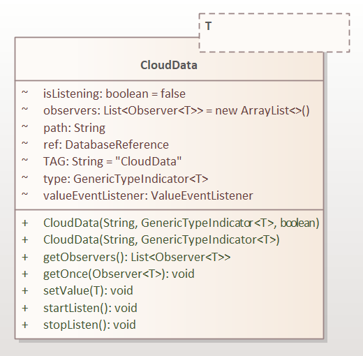  
4. 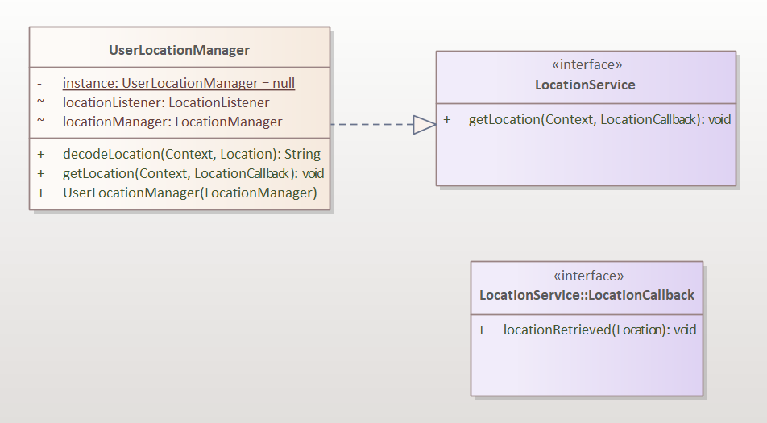  
5. 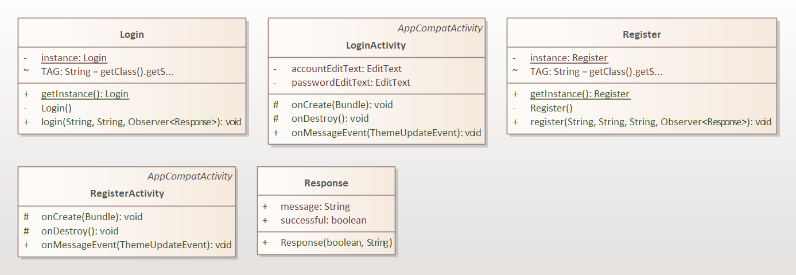  
6. 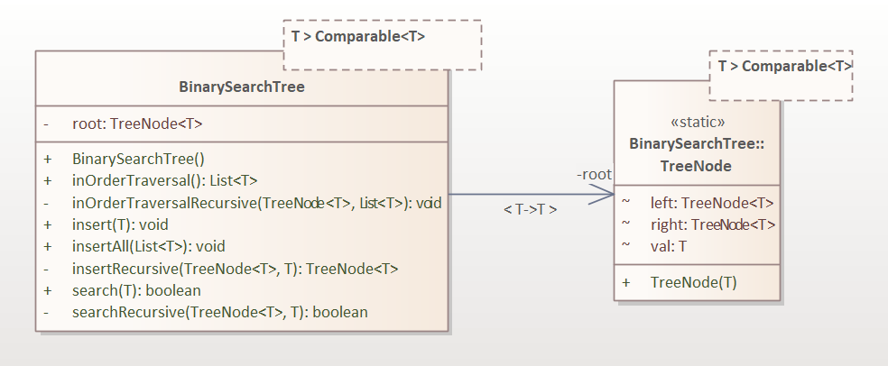  
7. 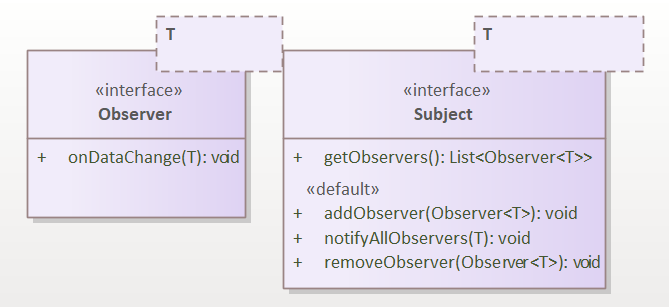  
8. 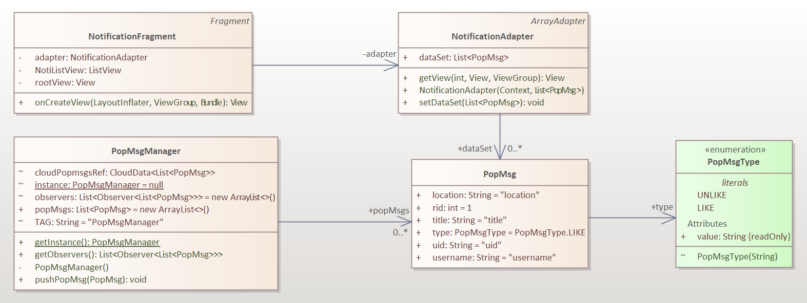  
9. 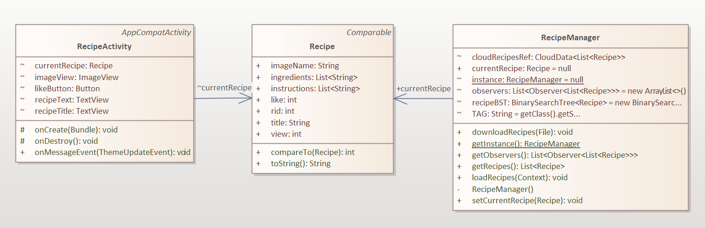  
10. 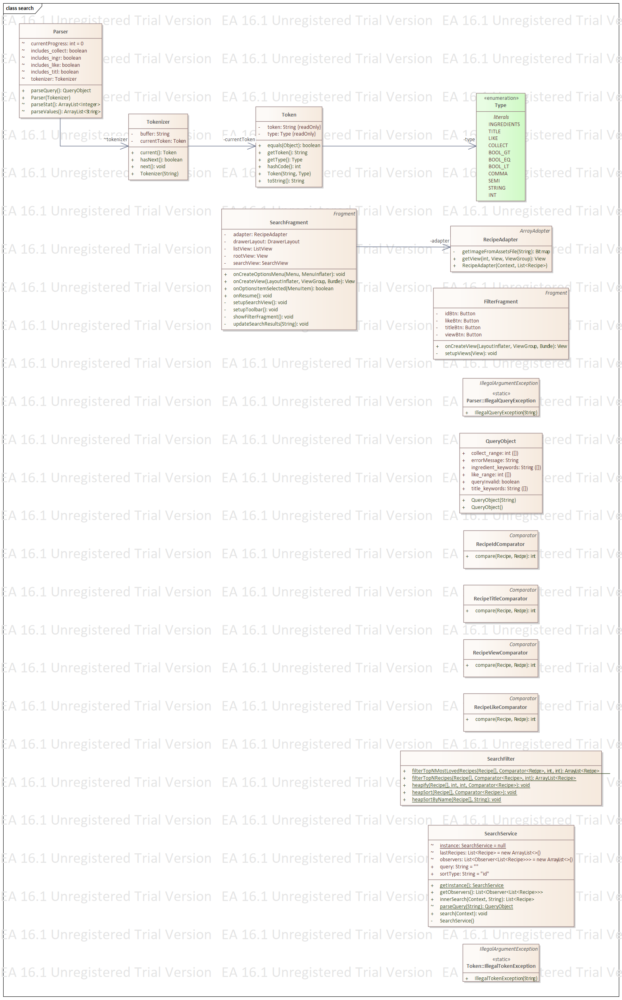  
11. 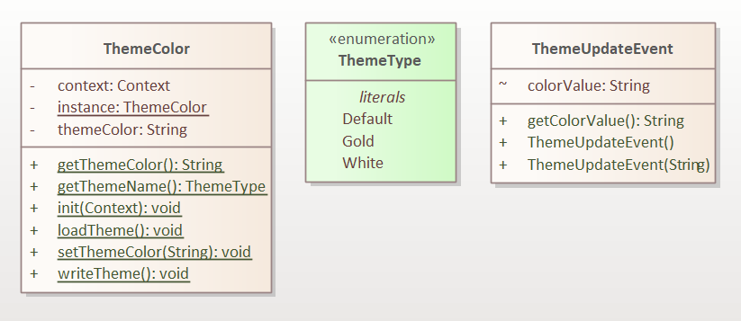  
12. 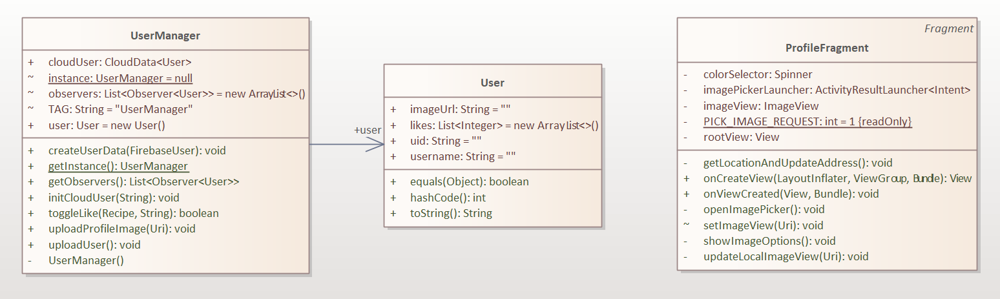  

## Code Design and Decisions

This is an important section of your report and should include all technical decisions made. Well-written justifications will increase your marks for both the report as well as for the relevant parts (e.g., data structure). This includes, for example,

- Details about the parser (describe the formal grammar and language used)

- Decisions made (e.g., explain why you chose one or another data structure, why you used a specific data model, etc.)

- Details about the design patterns used (where in the code, justification of the choice, etc)

*Please give clear and concise descriptions for each subsections of this part. It would be better to list all the concrete items for each subsection and give no more than `5` concise, crucial reasons of your design.

### Data Structures

*[What data structures did your team utilise? Where and why?]*

Here is a partial (short) example for the subsection `Data Structures`:*

*I used the following data structures in my project:*

1. *LinkedList*
   * *Objective: used for storing xxxx for xxx feature.*
   * *Code Locations: defined in [Class X, methods Z, Y](https://gitlab.cecs.anu.edu.au/comp2100/group-project/ga-23s2/-/blob/main/items/media/_examples/Dummy.java#L22-43) and [class AnotherClass, lines l1-l2](url); processed using [dataStructureHandlerMethod](url) and ...
   * *Reasons:*
      * *It is more efficient than Arraylist for insertion with a time complexity O(1)*
      * *We don't need to access the item by index for xxx feature because...*
      * For the (part), the data ... (characteristics) ...

2. ...

3. ...

### Design Patterns
*[What design patterns did your team utilise? Where and why?]*

1. *xxx Pattern*
   * *Objective: used for storing xxxx for xxx feature.*
   * *Code Locations: defined in [Class X, methods Z, Y](https://gitlab.cecs.anu.edu.au/comp2100/group-project/ga-23s2/-/blob/main/items/media/_examples/Dummy.java#L22-43) and [class AnotherClass, lines l1-l2](url); processed using [dataStructureHandlerMethod](url) and ...
   * *Reasons:*
      * ...

### Parser

### <u>Grammar(s)</u>
*[How do you design the grammar? What are the advantages of your designs?]*
*If there are several grammars, list them all under this section and what they relate to.*

Production Rules:

    <Non-Terminal> ::= <some output>
    <Non-Terminal> ::= <some output>

### <u>Tokenizers and Parsers</u>

*[Where do you use tokenisers and parsers? How are they built? What are the advantages of the designs?]*

### Others

*[What other design decisions have you made which you feel are relevant? Feel free to separate these into their own subheadings.]*

 

## Implemented Features
*[What features have you implemented? where, how, and why?]*  
*List all features you have completed in their separate categories with their featureId. THe features must be one of the basic/custom features, or an approved feature from Voice Four Feature.*

### Basic Features
1. [LogIn]. Description of the feature ... (easy)
   * Code: [Class X, methods Z, Y](https://gitlab.cecs.anu.edu.au/comp2100/group-project/ga-23s2/-/blob/main/items/media/_examples/Dummy.java#L22-43) and Class Y, ...
   * Description of feature: ...  
   * Description of your implementation: ...  

2. [DataFiles]. Description  ... ... (...)
   * Code to the Data File [users_interaction.json](link-to-file), [search-queries.xml](link-to-file), ...
   * Link to the Firebase repo: ...

3. ...
    

### Custom Features
Feature Category: Privacy  
1. [Privacy-Request]. Description of the feature  (easy)
   * Code: [Class X, methods Z, Y](https://gitlab.cecs.anu.edu.au/comp2100/group-project/ga-23s2/-/blob/main/items/media/_examples/Dummy.java#L22-43) and Class Y, ...
   * Description of your implementation: ...  
      

2. [Privacy-Block]. Description ... ... (medium)
   ... ...
     

Feature Category: Firebase Integration  
3. [FB-Auth] Description of the feature (easy)
   * Code: [Class X, entire file](https://gitlab.cecs.anu.edu.au/comp2100/group-project/ga-23s2/-/blob/main/items/media/_examples/Dummy.java#L22-43) and Class Y, ...
   * [Class B](../src/path/to/class/file.java#L30-85): methods A, B, C, lines of code: 30 to 85
   * Description of your implementation: ...  
Feature Category: Greater Data Usage, Handling and Sophistication  
1. [Data-Profile]  Create a Profile Page for Users or any Entities, which contains a media file (image,
   animation (e.g., gif), video). (easy) 
   * Code: [ProfileFragment.java]
   * This is a fragment to show profile data from the firebase, and can sycronized with the firebase.
   * By clicking the profile button in the navigation bar, the application will jump to the profile fragment.
   * In the fragment, there are 

### Surprise Features

- If implemented, explain how your solution addresses the task (any detail requirements will be released with the surprise feature specifications).
- State that "Suprised feature is not implemented" otherwise.

  

## Summary of Known Errors and Bugs

*[Where are the known errors and bugs? What consequences might they lead to?]*
*List all the known errors and bugs here. If we find bugs/errors that your team does not know of, it shows that your testing is not thorough.*

*Here is an example:*

1. *Bug 1:*
   - *A space bar (' ') in the sign in email will crash the application.*
   - ...

2. *Bug 2:*
3. ...

  

## Testing Summary

*[What features have you tested? What is your testing coverage?]*
*Please provide some screenshots of your testing summary, showing the achieved testing coverage. Feel free to provide further details on your tests.*

*Here is an example:*

1. Tests for Search
   - Code: [TokenizerTest Class, entire file](https://gitlab.cecs.anu.edu.au/comp2100/group-project/ga-23s2/-/blob/main/items/media/_examples/Dummy.java) for the [Tokenizer Class, entire file](https://gitlab.cecs.anu.edu.au/comp2100/group-project/ga-23s2/-/blob/main/items/media/_examples/Dummy.java#L22-43)
   - *Number of test cases: ...*
   - *Code coverage: ...*
   - *Types of tests created and descriptions: ...*

2. Tests for

...

  

## Team Management

### Meetings Records

- [Pre-Meeting](meeting/03-30.md)
- [Team Meeting 1](meeting/04-14.md)
- [Team Meeting 2](meeting/04-21.md)
- [Team Meeting 3](meeting/04-28.md)
- [Team Meeting 4](meeting/05-01.md)
- [Team Meeting 5](meeting/05-05.md)
- [Team Meeting 6](meeting/05-06.md)
- [Team Meeting 7](meeting/05-08.md)

### Conflict Resolution Protocol

Our team is divided into two subdivisions, with 3 people developing backend algorithms and 2 people developing frontend pages.
Each subdivision has its own leader.

When a conflict arises, the first step will be a brief subdivision meeting to assess the conflict.
This brief meeting is to find out the cause of the conflict, determine whether or not it affect the other subdivision's work, and assess the time needed for conflict resolution.

If the conflict is difficult to resolve, the leaders of the subdivisions will have a quick discussion to decide whether a team meeting with all group members is necessary.
An all-member group meeting will only be held if necessary.

Finally, a subdivision/all-member group meeting will be held as appropriate to facilitate clear communication and conflict resolution.

The minutes and outcomes of this meeting will be recorded, and decisions or adjustments to task allocation will be made accordingly.

If a member fails to meet the initial plan and/or deadlines, whether because of sickness or other circumstances, the team will adjust the project schedule and task allocations accordingly.

If the reason of the delay is difficulty in finishing the tasks, team members will work together to help solve the task.

If the reason of the delay is unforeseen circumstances outside of the person's control (like a member getting sick), other team members will tolerate the delay. If we are pressed on time, other team members may help this member with their tasks.

If the reason of the delay is something inexcusable like one's unwillingness to work, then this will be treated like a conflict and will be treated according to the aforementioned conflict resolution measures.
