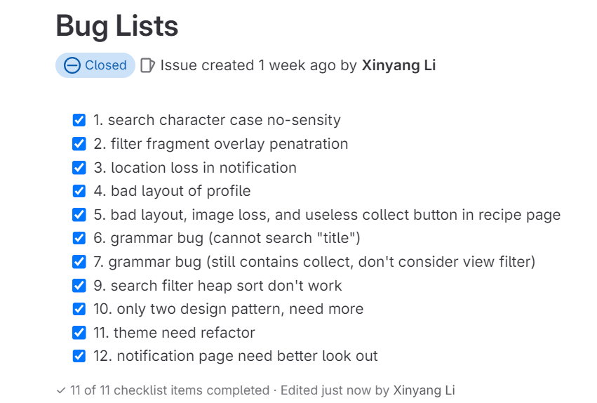

# [G26 - CookCompass] Report

The following is a report template to help your team successfully provide all the details necessary for your report in a structured and organised manner. Please give a straightforward and concise report that best demonstrates your project. Note that a good report will give a better impression of your project to the reviewers.

Note that you should have removed ALL TEMPLATE/INSTRUCTION textes in your submission (like the current sentence), otherwise it hampers the professionality in your documentation.

*Here are some tips to write a good report:*

* `Bullet points` are allowed and strongly encouraged for this report. Try to summarise and list the highlights of your project (rather than give long paragraphs).*

* *Try to create `diagrams` for parts that could greatly benefit from it.*

* *Try to make your report `well structured`, which is easier for the reviewers to capture the necessary information.*

*We give instructions enclosed in square brackets [...] and examples for each sections to demonstrate what are expected for your project report. Note that they only provide part of the skeleton and your description should be more content-rich. Quick references about markdown by [CommonMark](https://commonmark.org/help/)*

## Table of Contents

- [\[G26 - CookCompass\] Report](#g26---cookcompass-report)
  - [Table of Contents](#table-of-contents)
  - [Administrative](#administrative)
  - [Team Members and Roles](#team-members-and-roles)
  - [Summary of Individual Contributions](#summary-of-individual-contributions)
  - [Application Description](#application-description)
    - [Application Use Cases and or Examples](#application-use-cases-and-or-examples)
      - [Target users](#target-users)
      - [Use cases](#use-cases)
    - [Application UML](#application-uml)
  - [Code Design and Decisions](#code-design-and-decisions)
    - [Data Structures](#data-structures)
    - [Design Patterns](#design-patterns)
    - [Parser](#parser)
    - [Grammar(s)](#grammars)
    - [Tokenizers and Parsers](#tokenizers-and-parsers)
    - [Others](#others)
  - [Implemented Features](#implemented-features)
    - [Basic Features](#basic-features)
    - [Custom Features](#custom-features)
    - [Surprise Features](#surprise-features)
  - [Summary of Known Errors and Bugs](#summary-of-known-errors-and-bugs)
  - [Testing Summary](#testing-summary)
  - [Team Management](#team-management)
    - [Meetings Records](#meetings-records)
    - [Conflict Resolution Protocol](#conflict-resolution-protocol)

## Administrative
- Firebase Repository Link: <insert-link-to-firebase-repository>
   - Confirm: I have already added comp21006442@gmail.com as a Developer to the Firebase project prior to due date.
- Two user accounts for markers' access are usable on the app's APK (do not change the username and password unless there are exceptional circumstances. Note that they are not real e-mail addresses in use):
   - Username: comp2100@anu.edu.au	Password: comp2100
   - Username: comp6442@anu.edu.au	Password: comp6442

## Team Members and Roles
The key area(s) of responsibilities for each member

| UID      |      Name      |                                                                                                                                                                                                                                      Role |
| :------- | :------------: | ----------------------------------------------------------------------------------------------------------------------------------------------------------------------------------------------------------------------------------------: |
| u7760022 |   Xinyang Li   |                                                                                                                             Backend (Login, DataFiles, LoadShowData, DataStream, Search-Invalid, FB-Auth, FB-Persist-extension, Register) |
| u7752874 |   Xinlei Wen   |                                                                                    Backend (LoadShowData, Search, Data-Formats)                                                                                                    [role] |
| u7754676 | Tashia Tamara  |                                                                                                                                                                                                  Backend (Login, Search-Filter, Data-GPS) |
| u7759982 | Jiangbei Zhang |                                             Frontend (Login, Data-Profile, Register)                                                                                                                                               [role] |
| u7693070 |  Changlai Sun  | Frontend (LoadShowData, Search, Search-Filter)                                                                                                                                                                                     [role] |


## Summary of Individual Contributions

1. **U7760022, Xinyang Li**  I have 20% contribution, as follows: 
- **Code Contribution in the Final App**
    - Feature
        - Feature 1 Login, Feature 11 fb-auth
            - [Login.java](app/src/main/java/anu/cookcompass/login/Login.java)
            - [Register.java](app/src/main/java/anu/cookcompass/login/Register.java)
            - [Response.java](app/src/main/java/anu/cookcompass/login/Response.java)
        - Feature 2 dataFiles, Feature 12 fb-persist-extension
            - [CloudData.java](app/src/main/java/anu/cookcompass/firebase/CloudData.java)
        - Feature 3 LoadShowData
            - [Recipe.java](app/src/main/java/anu/cookcompass/recipe/Recipe.java)
            - [RecipeActivity.java](app/src/main/java/anu/cookcompass/recipe/RecipeActivity.java)
            - [RecipeManager.java](app/src/main/java/anu/cookcompass/recipe/RecipeManager.java)
            - [UserManager.java](app/src/main/java/anu/cookcompass/user/UserManager.java)
        - Feature 4 DataStream
            - [PopMsg.java](app/src/main/java/anu/cookcompass/popmsg/PopMsg.java)
            - [PopMsgType.java](app/src/main/java/anu/cookcompass/popmsg/PopMsgType.java)
            - [PopMsgManager.java](app/src/main/java/anu/cookcompass/popmsg/PopMsgManager.java)
            - [UserSimulator.java](app/src/main/java/anu/cookcompass/datastream/UserSimulator.java)
        - Feature 6 search-invalid
            - [SearchService.java](app/src/main/java/anu/cookcompass/search/SearchService.java)
    - Design Pattern 
        - Singleton & Factory
            - [SingletonFactory.java](app/src/main/java/anu/cookcompass/pattern/SingletonFactory.java)
        - Facade
            - [SearchService.java search()](app/src/main/java/anu/cookcompass/search/SearchService.java#L63)
        - Observer
            - interface: 
                - [Observer.java](app/src/main/java/anu/cookcompass/pattern/Observer.java)
                - [Subject.java](app/src/main/java/anu/cookcompass/pattern/Subject.java)
            - implementation:
                - [CloudData.java](app/src/main/java/anu/cookcompass/firebase/CloudData.java)
    - Data Structure
        - Binary Search Tree 
            - [BinarySearchTree.java](app/src/main/java/anu/cookcompass/model/BinarySearchTree.java)

- **Code and App Design**
    - UI Design
        - UI design for the recipe page: [activity_recipe.xml](app/src/main/res/layout/activity_recipe.xml)
        - UI design for rounded background:[rounded_background.xml](app/src/main/res/drawable/rounded_background.xml)
        - UI design for rounded card:[rounded_card.xml](app/src/main/res/drawable/rounded_card.xml)
    - Unit Test
        - [ParserTest](app/src/test/java/anu/cookcompass/ParserTest.java)
        - [SearchServiceTest](app/src/test/java/anu/cookcompass/SearchServiceTest.java)
        - [TokenizerTest](app/src/test/java/anu/cookcompass/TokenizerTest.java)
        - [BinarySearchTreeTest](app/src/test/java/anu/cookcompass/BinarySearchTreeTest.java)
- Others:
    - git name and email: u7760022(u7760022@anu.edu.au) and bridge(wxlxy316@163.com)
    - I use these two emails for git commit, both are me

2. **U7759982, Jiangbei Zhang**  I have 20% contribution, as follows: 
- **Code Contribution in the Final App**
    - Feature Feat 1 login, Feat 9 data Profile, Feat 4 data stream 
      - class ProfileFragment: [ProfileFragment.java](https://gitlab.cecs.anu.edu.au/u7760022/gp-24s1/blob/main/app/src/main/java/anu/cookcompass/user/ProfileFragment.java)
      - class NotificationFragment:[NotificationFragment.java](https://gitlab.cecs.anu.edu.au/u7760022/gp-24s1/blob/main/app/src/main/java/anu/cookcompass/popmsg/NotificationFragment.java)
      - class NotificationAdapter:[NotificationAdapter.java](https://gitlab.cecs.anu.edu.au/u7760022/gp-24s1/blob/main/app/src/main/java/anu/cookcompass/popmsg/NotificationAdapter.java)
    - Other UI related java class 
      - class MainActivity [MainActivity.java](https://gitlab.cecs.anu.edu.au/u7760022/gp-24s1/blob/main/app/src/main/java/anu/cookcompass/MainActivity.java)
      - class BottomBarActivity [BotommBarActivity.java](https://gitlab.cecs.anu.edu.au/u7760022/gp-24s1/blob/main/app/src/main/java/anu/cookcompass/BottomBarActivity.java)
      - class CircleImageView [CircleImageView.java](https://gitlab.cecs.anu.edu.au/u7760022/gp-24s1/blob/main/app/src/main/java/anu/cookcompass/theme/CircleImageView.java)
      - class RegisterActivity [RegisterActivity.java](https://gitlab.cecs.anu.edu.au/u7760022/gp-24s1/blob/main/app/src/main/java/anu/cookcompass/login/RegisterActivity.java)
    - <br><br>

- **Code and App Design**
    - UI Design
      - UI design for the login page: [activity_login.xml](https://gitlab.cecs.anu.edu.au/u7760022/gp-24s1/blob/main/app/src/main/res/layout/activity_login.xml)
      - UI design for the main page: [activity_main.xml](https://gitlab.cecs.anu.edu.au/u7760022/gp-24s1/blob/main/app/src/main/res/layout/activity_main.xml)
      - UI design for the nagivation bar:[activity_navigation_bar.xml](https://gitlab.cecs.anu.edu.au/u7760022/gp-24s1/blob/main/app/src/main/res/layout/activity_navigation_bar.xml)
      - UI design for the fragment_notification page:[fragment_notification.xml](https://gitlab.cecs.anu.edu.au/u7760022/gp-24s1/blob/main/app/src/main/res/layout/activity_navigation_bar.xml)
      - UI design for the fragment_profile page:[fragment_profile.xml](https://gitlab.cecs.anu.edu.au/u7760022/gp-24s1/blob/main/app/src/main/res/layout/fragment_profile.xml)
      - UI design for the notification_item:[notification_item.xml](https://gitlab.cecs.anu.edu.au/u7760022/gp-24s1/blob/main/app/src/main/res/layout/notification_item.xml)
      - UI design for bottom_bar_background:[bottom_bar_bg.xml](https://gitlab.cecs.anu.edu.au/u7760022/gp-24s1/blob/main/app/src/main/res/menu/bottom_bar_bg.xml)
      - UI design for profile_text background:[profile_text_background.xml](https://gitlab.cecs.anu.edu.au/u7760022/gp-24s1/blob/main/app/src/main/res/drawable/profile_text_background.xml)
      - UI design for login account icon:[baseline_account_box_24.xml](https://gitlab.cecs.anu.edu.au/u7760022/gp-24s1/blob/main/app/src/main/res/drawable/baseline_account_box_24.xml)
      - UI design for register back arrow icon:[round_arrow_back_24.xml](https://gitlab.cecs.anu.edu.au/u7760022/gp-24s1/blob/main/app/src/main/res/drawable/round_arrow_back_24.xml)
    - 
    - External resources of my UI part
      -  free for non-commercial use, CC BY "best_leeyang"
      - {width=20%}{height=20%} free for non-commercial use, CC BY "逍剑"
      -  free for non-commercial use, CC BY "best_leeyang"
      -  free for non-commercial use, CC BY "best_leeyang"
      -  Public Domain,free to use

3. **U7752874, Xinlei Wen** I have 20% contribution, as follows:
- **Code Contribution in the Final App**
    - Basic Feature 5a: Grammar, tokenizer and parser
        - class Token [Token.java](app/src/main/java/anu/cookcompass/search/Token.java)
        - class Tokenizer [Tokenizer.java](app/src/main/java/anu/cookcompass/search/Tokenizer.java)
        - class Parser [Parser.java](app/src/main/java/anu/cookcompass/search/Parser.java)
        - class QueryObject [QueryObject.java](app/src/main/java/anu/cookcompass/search/QueryObject.java)
    - Custom Feature: Data-Formats (using txt and csv files)
        - class ThemeColor [ThemeColor.java](app/src/main/java/anu/cookcompass/theme/ThemeColor.java)
        - class ThemeUpdateEvent [ThemeUpdateEvent.java](app/src/main/java/anu/cookcompass/theme/ThemeUpdateEvent.java)
        - functions for switching theme (`onMessage` and `updateTheme`) in view model classes, including [ProfileFragment.java](app/src/main/java/anu/cookcompass/user/ProfileFragment.java), [LoginActivity.java](app/src/main/java/anu/cookcompass/login/LoginActivity.java), [RegisterActivity.java](app/src/main/java/anu/cookcompass/login/RegisterActivity.java), [SearchFragment.java](app/src/main/java/anu/cookcompass/search/SearchFragment.java), [RecipeActivity.java](app/src/main/java/anu/cookcompass/recipe/RecipeActivity.java) and [MainActivity.java](app/src/main/java/anu/cookcompass/MainActivity.java)
- **Code and App Design** 
    - Design Pattern: Singleton (used in class `ThemeColor`)

4. **U7693070, Changlai Sun** I have 20% contribution, as follows:
- **Code Contribution in the Final App**
    - Feature Feat 3 LoadShowData, Feat 5 Search, Search-Filter
        - class RecipeAdapter [RecipeAdapter.java](app/src/main/java/anu/cookcompass/search/RecipeAdapter.java)
        - class SearchFragment [SearchFragment.java](app/src/main/java/anu/cookcompass/search/RecipeAdapter.java)
        - class FilterFragment [FilterFragment.java](app/src/main/java/anu/cookcompass/search/FilterFragment.java)
- **Code and App Design**
    - UI Design
        - UI design for the custom listview item of search result [list_item.xml](app/src/main/res/layout/list_item.xml)
        - UI design for the search page [fragment_search.xml](app/src/main/res/layout/fragment_search.xml)
        - UI design for the search bar and filter button [toolbar_menu.xml](app/src/main/res/menu/toolbar_menu.xml)
        - UI design for the filter drawer [fragment_filter.xml](app/src/main/res/layout/fragment_filter.xml)

5**U7754676, Tashia Tamara** I have 20% contribution, as follows:
- **Code Contribution in the Final App**
    - Features: LogIn (Basic), Search-Filter (Custom), Data-GPS (Custom)
    - Classes in the Final App:
        - class Login [Login.java](https://gitlab.cecs.anu.edu.au/u7760022/gp-24s1/-/blob/main/app/src/main/java/anu/cookcompass/login/Login.java)
        - class Register [Register.java](https://gitlab.cecs.anu.edu.au/u7760022/gp-24s1/-/blob/main/app/src/main/java/anu/cookcompass/login/Register.java)
        - class SearchFilter [SearchFilter.java](https://gitlab.cecs.anu.edu.au/u7760022/gp-24s1/-/blob/main/app/src/main/java/anu/cookcompass/searchfilter/SearchFilter.java)
        - interface LocationService [LocationService.java](https://gitlab.cecs.anu.edu.au/u7760022/gp-24s1/-/blob/main/app/src/main/java/anu/cookcompass/gps/LocationService.java)
        - class UserLocationManager [UserLocationManager.java](https://gitlab.cecs.anu.edu.au/u7760022/gp-24s1/-/blob/main/app/src/main/java/anu/cookcompass/gps/UserLocationManager.java)
    - Old Version of Classes (Modified, improved, and refactored into the classes in the final app):
        - class Login (Split into Login.java and Register.java in the final app) [Login.java (Old)](https://gitlab.cecs.anu.edu.au/u7760022/gp-24s1/-/blob/f4a9ac18c03bcb232bced4ddc4b56c7be3abf51f/app/src/main/java/anu/cookcompass/login/Login.java)
        - class LocationManagerClass + LocationService interface (Split into LocationService.java and UserLocationManager.java in the final app) [LocationService.java (Old)](https://gitlab.cecs.anu.edu.au/u7760022/gp-24s1/-/blob/f9c37abe999dde22c894cf92370a3518f58cd2c6/app/src/main/java/anu/cookcompass/gps/LocationService.java)
- **Code and App Design**
    - Data Structure: Heap (Binary tree-based data structure) (Used in class `SearchFilter`)
- **Others**
    - Contributed to the report (outside of my personal contribution subsection) by writing the following sections:
        - Team Members and Roles
        - Application Description
        - Target Users (In section: Application Use Cases and or Examples)
        - (Generated) UML Subdiagrams (In section: Application UML)
        - Meeting Records and Conflict Resolution Protocol (In section: Team Management)
    - Wrote and committed all meeting minutes
    - Helped create the app demo video
    - Created the PPT slides for Minute Madness
    - Presented the group presentation during Minute Madness

## Application Description

CookCompass is a recipe application targeted towards people are interested in cooking. It provides thousands of recipes featuring lots of different ingredients. Users can sort the recipes based on their id number, title, likes, and views. They can also look for recipes of a certain level of popularity, for example recipes with at least 100 likes or views. 

{width=50%}

<details>
<summary style="font-size:20px;">more screenshot</summary>

{width=50%}
{width=50%}
{width=50%}
{width=50%}
{width=50%}
{width=50%}
{width=50%}
</details>

### Application Use Cases and or Examples

#### Target users 

Home cooks / People interested in cooking

* Users can use it to look up various kinds of recipes.
* Users can use the app's search feature to look up recipes by typing in keywords into the search bar.
* Users can like recipes, thereby adding to the recipe's like count.
* Every time another user of the app likes or unlikes recipes, the user will receive a notification. The user can also see which location this other user is liking/unliking the recipe from. This helps the user keep track of in which countries certain recipes are currently gaining or losing popularity. 
* Users can sort the recipe search results according to the recipe's id number, title, likes, and views.
* Users can also customize their app experience by changing their profile picture and/or changing the app's theme color.

#### Use cases

- Looking Up Recipes:
    - Alice wants to find a new dessert recipe to try out this weekend. She opens the app and types "chocolate cake" into the search bar. The app displays a list of chocolate cake recipes sorted by popularity. Alice browses through the recipes, looking at the ratings and views to decide which one to try.

- Liking a Recipe:
    - Bob tries a new pasta recipe he found on the app and loves it. He decides to like the recipe, adding to its like count. Later, he receives a notification that someone in Italy has also liked the same recipe. Bob finds it interesting to see that the recipe is gaining popularity in different parts of the world.

- Receiving Notifications:
    - Catherine enjoys exploring different cuisines and likes recipes from various countries. She gets a notification that a user in Japan has liked a sushi recipe she recently discovered. She appreciates these notifications as they help her see global trends in cooking.

- Sorting and Filtering Recipes:
    - David is planning a dinner party and wants to impress his guests with a popular dish. He uses the app's search feature to look up "dinner recipes" and sorts the results by likes. He then filters the results to show the top 10 recipes with at least 100 likes. This helps him quickly find tried-and-tested recipes that are likely to be a hit at his party.

- Customizing the App Experience:
    - Emma loves personalizing her apps. She changes her profile picture to a photo of her favorite dish and updates the app's theme color to match her kitchen decor. This makes the app feel more tailored to her preferences and enhances her user experience.

<hr> 

### Application UML


<details> 
<summary style="font-size:20px;">UML Subdiagrams (Based on Package)</summary>


 


 
 
 
 

 


</details>

<hr>

## Code Design and Decisions

This is an important section of your report and should include all technical decisions made. Well-written justifications will increase your marks for both the report as well as for the relevant parts (e.g., data structure). This includes, for example,

- Details about the parser (describe the formal grammar and language used)

- Decisions made (e.g., explain why you chose one or another data structure, why you used a specific data model, etc.)

- Details about the design patterns used (where in the code, justification of the choice, etc)

*Please give clear and concise descriptions for each subsections of this part. It would be better to list all the concrete items for each subsection and give no more than `5` concise, crucial reasons of your design.

<hr>

### Data Structures

*[What data structures did your team utilise? Where and why?]*

*We used the following data structures in our project:*

1. *BinearySearchTree*
   * *Objective: used for Data Instance Storage*
   * *Code Locations: defined in [BinarySearchTree.java](app/src/main/java/anu/cookcompass/model/BinarySearchTree.java) and [RecipeManager.java](app/src/main/java/anu/cookcompass/recipe/RecipeManager.java)
   * *Reasons:*
      * *It is more efficient than Arraylist for insertion with a time complexity O(logn)*
      * *We don't need to access the item by index for xxx feature because...*
      * For the (part), the data ... (characteristics) ...

2. *Heap*
   * *Objective: used for sorting the Recipe array as part of the Search Filter feature (heapSort)*
   * *Code Locations: Defined in [SearchFilter.java](https://gitlab.cecs.anu.edu.au/u7760022/gp-24s1/-/blob/main/app/src/main/java/anu/cookcompass/searchfilter/SearchFilter.java)
   * *Reasons:*
       * *Heap sort is quite memory-efficient, having a space complexity of O(1). This is because it does in-place sorting, meaning the amount of space or memory used isn't directly proportional to the number of objects in the array being sorted.*
       * *Heap sort has a time complexity of O(n logn), which is the optimal time complexity for comparison-based sorting algorithms dealing with large arrays.*

<hr>

### Design Patterns
*[What design patterns did your team utilise? Where and why?]*

1. Singleton
    * Objective: used for implementation of Singleton of a lot of classes
    * Code Locations: defined in [RecipeManager.java](app/src/main/java/anu/cookcompass/recipe/RecipeManager.java), [UserManager.java](app/src/main/java/anu/cookcompass/user/UserManager.java) and [PopMsgManager.java](app/src/main/java/anu/cookcompass/popmsg/PopMsgManager.java)
    * Reasons: 
        * RecipeManager: this class stores all recipes when the app start. When frnot-end page switches, we don't need to use intent to pass big data, just visit RecipeManager can get all data. Obviously, all recipes data could only have one instance without any copy.
        * UserManager: this class stores current user when user logged in successfully. Then we open profile page, the front-end could easily access the user property from UserManager. Obviously, current user could only have one instance without any copy.
        * PopMsgManager: this class stores all pop messages when the app start. When frnot-end page switches, we don't need to use intent to pass big data, just visit PopMsgManager can get all data. Obviously, all pop messages data could only have one instance without any copy.

2. SingletonFactory
    * Objective: used for implementation of Sing of a lot of classes
    * Code Locations: defined in [Class Singleton Factory](https://gitlab.cecs.anu.edu.au/comp2100/group-project/ga-23s2/-/blob/main/items/media/_examples/Dummy.java#L22-43) and [class AnotherClass, lines l1-l2](url); processed using [dataStructureHandlerMethod](url) and ...
    * Reasons: avoid writing a lot of code to implement singleton

3. Observer
    * Objective: used for implementation of Sing of a lot of classes
    * Code Locations:
        * interface defined in [Observer.java](app/src/main/java/anu/cookcompass/pattern/Observer.java) and [Subject.java](app/src/main/java/anu/cookcompass/pattern/Subject.java)
        * implementation defined in [RecipeManager.java](app/src/main/java/anu/cookcompass/recipe/RecipeManager.java), [UserManager.java](app/src/main/java/anu/cookcompass/user/UserManager.java), [PopMsgManager.java](app/src/main/java/anu/cookcompass/popmsg/PopMsgManager.java) and [CloudData.java](app/src/main/java/anu/cookcompass/firebase/CloudData.java)
    * Reasons: 
        * interface: avoid writing a lot of code to implement Observer
        * RecipeManager: When recipes update, the search page will be notified and update its content.
        * PopMsgManager: When pop messages update, the notification page will be notified and update its content.
        * UserManager: When current user data updates, the user profile page will be notified and update the content.
        * CloudData: When cloud data updates, this class will be updated, and then its observers will be notified. This design can help us easily implement data synchronization (Feature 12 fb-persist-extension).
    * Advantages:
        * Decoupling: The Observer pattern promotes loose coupling between the subject and the observers. The subject does not need to know the specifics about the observers; it only knows that they implement a certain interface. This decoupling allows both subjects and observers to be developed and modified independently.
        * Flexibility and Extensibility: Adding new observers is easy and does not require changes to the subject. This makes the system more flexible and easier to extend with new functionality.
        * Reusability: Observers can be reused across different subjects, enhancing the reusability of components. Similarly, subjects can work with different observers without requiring changes to the subject's code.
        * Event Handling: The Observer pattern is ideal for implementing event handling systems. When an event occurs, the subject notifies all registered observers, which can then handle the event appropriately. This makes it easier to manage and respond to events in a clean and organized manner.
        * Dynamic Relationships: Relationships between subjects and observers can be established at runtime, allowing for dynamic and flexible interactions. Observers can be added or removed on the fly without affecting the overall system.
        * Consistency: The Observer pattern ensures consistency across observers. When the subject's state changes, all observers are notified and updated automatically, ensuring that all parts of the system remain in sync. 

4. Facade
    * Objective: used for implementation of Sing of a lot of classes
    * Code Locations: defined in [SearchService.java search()](app/src/main/java/anu/cookcompass/search/SearchService.java#L63)
    * Reasons: 
        * To aggregate three modules (search, search-invalid, search-filter) so that the front end can call a unified interface without worrying about the implementation details, you can use the Facade pattern. 
    * Advantage:
        * Simplified Interface: The Facade pattern hides the complexities of the subsystem by providing a straightforward and easy-to-use interface, making client code simpler and more intuitive. 
        * Loose Coupling: By decoupling the client from the complex subsystem, the Facade pattern reduces dependencies. This means that if the subsystem changes, only the Facade needs to be updated, not the client code.
        * Improved Readability and Maintainability: With a simpler and clearer interface provided by the Facade, code becomes more readable and maintainable. Developers do not need to understand the intricate details of the subsystem; they only interact with the Facade.
        * Better Layered Structure: The Facade pattern helps define a clear structure within the system, clarifying the dependencies between different layers. It can act as a middle layer that coordinates interactions between various parts of the system.
        * Enhanced Security: By using the Facade pattern, access to the subsystem can be controlled and restricted. Only the Facade is used to access the subsystem, protecting the subsystem from direct access and potential misuse.


<hr>

### Parser

### <u>Grammar(s)</u>
*[How do you design the grammar? What are the advantages of your designs?]*
*If there are several grammars, list them all under this section and what they relate to.*

Production Rules:

```#
    <Query> ::= <Ingr-Query> <Titl-Query> <Like-Query> <View-Query>
    <Ingr-Query> ::= ingredients = <Names>; | EMPTY
    <Titl-Query> ::= title = <Names>; | EMPTY
    <Like-Query> ::= like <BoolOperator> INTEGER ; | EMPTY
    <View-Query> ::= view <BoolOperator> INTEGER ; | EMPTY
    <Names> ::== STRING | STRING , <Names>
    <BoolOperator> ::=  > | <  | = 
```
In this grammar, every part of the input could ONLY be separated by symbols, and spaces between symbols and strings will be ignored. That means, "ingredients=apple;" and "ingredients       = apple         ;" has exactly the same effect. This is to provide an approach to arrange the search input in a more reading friendly way.

Note that in this grammar, query to any data type (ingredients, title, etc.) could not appear more than once, and must follow the order given by the first equation.

This grammar is designed to support searching certain recipe with given title or ingredients, and do filtering on the like or view number. By applying this grammar, we could not only search keywords, but also filtering the result, which makes the filtering page clearer.

Specifically, in the actual application, a search invalid feature is implemented, allows user to search with an input that does not fully satisfies this grammar. However, this feature is not implemented in parser. For testing the parser, a fully correct input is still required.


### <u>Tokenizers and Parsers</u>

*[Where do you use tokenisers and parsers? How are they built? What are the advantages of the designs?]*

We implemented one tokenizer and one parser in our application, which is used as a supportive module of the searching functionality (see `Tokenizer.java` and `Parser.java` in package `search`). No external libraries that provides tokenizing or parsing are used, and the implementation has a simiilar format as the one provided in labs.

In a searching process, user enters their need formatted in the formal grammar shown above, and the tokenizer and parser will then be called, creating an object that contains every information in the input (object `QueryObject`). The search module only handles this query object.

Specifically, the token used in our project only includes symbols (e.g., '<', ',' and '=') and strings, which means the tokenizer will treat everything except the given symbols as a string (instead of consider keywords like "title" and "ingredients" as "title token" or "ingredients token"). This design ensures any word to be used as a STRING, avoiding problems when you try inputs like "title = title;" (if you do so, as this input fits the grammar, the application will not consider it as an illegal input. Instead you will get 0 results, as there are no recipies named "title", but no warning messages will be shown).

By using a tokenizer and parser, it is easier to parse search inputs, enabling a clear filtering rule for the search module to perform its task. Besides, it separates the raw input from the frontend with the search interface in the backend, protects the search module from invalid inputs.

<hr>

### Git Commit Regulation

**We make a [git commit regulation](items/git.md) to help make git commit more clean and readable.**

every commit should start with a [git-emoji](https://gitmoji.dev/) and the label name, followed with the description of what you do.

`:emoji: [type name] what I do`

| git-emoji                       | label name  | description example                                        |
|---------------------------------|-------------|------------------------------------------------------------|
| :sparkles: `:sparkles:`         | feat        | user login                                                 |
| :memo: `:memo:`                 | docs        | team meeting                                               |
| :bug: `:bug:`                   | fix         | fix the bug: certain usernames will cause the app to crash |
| :recycle: `:recycle:`           | refactor    | refactor user login module for better performance          |
| :construction: `:construction:` | going       | working on the feature: user login                         |

**We also work on different branches when we develop our app, so that our work won't make bad effect on others'.**

Every developer creating a new feature should create a new branch from the `dev` branch. The branch name should be brief and directly related to the feature. All code changes must be committed to this branch.

When the feature has been completed, the developer could require to merge feature branch into the `dev` branch.

Once a sufficient number of features have been completed and merged into the `dev` branch, we may consider pushing a release of our project. Following thorough and careful testing, we can then merge the `dev` branch into the `main` branch.

We aim to guarantee that every checkout from the `main` branch results in a usable app.

Following images show how the branches stem and merge:


### Others

*[What other design decisions have you made which you feel are relevant? Feel free to separate these into their own subheadings.]*


<hr>

## Implemented Features
*[What features have you implemented? where, how, and why?]* 
*List all features you have completed in their separate categories with their featureId. THe features must be one of the basic/custom features, or an approved feature from Voice Four Feature.*

### Basic Features

1.[LogIn]. Users must be able to log in. (easy)
   * Code: [Login(old version)](https://gitlab.cecs.anu.edu.au/u7760022/gp-24s1/-/blob/f4a9ac18c03bcb232bced4ddc4b56c7be3abf51f/app/src/main/java/anu/cookcompass/login/Login.java)
   * Description of feature: User can log in our app.
   * Description of your implementation: Every time user open our app, the first page of the app will be the login page, and after they input their username and password and then click the login button, the app will check its authority via a local data file.
   * But with the development of our project, this code has been replaced. Because we implemented Feature fb-auth and don't store users in local file.

2. [DataFiles]. Create a dataset with at least 2,500 valid data instances, each representing a meaningful piece of information in your app. The data should be represented and stored in a structured format taught in the course. (easy)
   * Link to the Firebase repo: [realtime database](https://console.firebase.google.com/project/cookcompass-4eed7/database/cookcompass-4eed7-default-rtdb/data)
   * What I do: pre-process recipe dataset (I get it from kaggle) into json format and upload it into firebase realtime database. 

    
3. [LoadShowData] Load and display data instances from your dataset. Choose an appropriate format to present the different types of data. (easy)
   * Link to the Firebase repo: [realtime database](https://console.firebase.google.com/project/cookcompass-4eed7/database/cookcompass-4eed7-default-rtdb/data)
    * What I do: implement the data synchronization between cloud and memory. When the cloud data updated, app would update. And the same things will happen on another direction; implement like action, so user can like or unlike a recipe; implement pop message and its manager, when user click "like", other users will receive a pop message that someone liked a recipe.
    * implement the data synchronization between cloud and memory. When the cloud data updated, app would update. And the same things will happen on another direction; implement like action, so user can like or unlike a recipe; implement pop message and its manager, when user click "like", other users will receive a pop message that someone liked a recipe.


4. [DataStream] Create data instances to simulate users’ actions and interactions, which are then used to feed the app so that when a user is logged in, these data are loaded at regular time intervals and visualised on the app. (medium)
    * Code to the Data File [users_interaction.json](link-to-file), [search-queries.xml](link-to-file), ...
    * Link to the Firebase repo: ...
    * What I do: implement user simulator to create fake pop message instance per 10 seconds, so that when user log in the app and open the profile page, click the "start data stream" button, this app will start to receive fake user operations we create, for example, Bernardo like the recipe xxxx.


5. [Search] Users must be able to search for information on your app. (medium)
    * Code to the Data File [users_interaction.json](link-to-file), [search-queries.xml](link-to-file), ...
    * Link to the Firebase repo: ...


### Custom Features

**Feature Category: Search-related features**

6. [Search-Invalid] On top of giving search results from valid inputs, search functionality can process and correctly handle partially invalid search queries and give meaningful results. (medium)
    * Code: [SearchService.java searchByInformalQuery()](app/src/main/java/anu/cookcompass/search/SearchService.java)
    * Description of your implementation: make code to improve search function so that it can handle informal search query or partially incorrect query. When user forget to type ";" in their query, the search function will correct it and return relevant results. When user are lazy to type the whole query and only type title_keywords, such like "apple, orange", the search function will auto handle it as "title=apple, orange;" and return relevant results.

    
7. [Search-Filter] Sort and filter a list of items returned from searches, with the use of suitable UI components. (easy)
    * Code: [Class: SearchFilter.java, Methods: heapSortByName(), heapSort(), heapify()](https://gitlab.cecs.anu.edu.au/u7760022/gp-24s1/-/blob/main/app/src/main/java/anu/cookcompass/searchfilter/SearchFilter.java)
      * There are also four more classes in the same file that implements Comparator<Recipe>, which with its own compare() method:
        * RecipeIdComparator class
        * RecipeTitleComparator class
        * RecipeViewComparator class
        * RecipeLikeComparator class
    * Description of your implementation:
      * Logic for building max heap is defined in heapify().
      * Max heap is built according to the order defined by the chosen comparator. 
      * The default order for the id and title comparators is ascending, while the default order for the view and like comparators is descending.
      * In heapSort(), we call heapify() to actually build the max heap.
      * Then, we sort the array by extracting the largest element and placing it at the end of the array.
      * After each extraction, we rebuild the max heap. We repeat this until the entire array has been sorted.
      * Finally, heapSortByName() is the method that allows the front-end to use this back-end code.
      * It matches the criterionName String parameter to the corresponding comparator.
      * The boolean isDefaultOrder gives users the option to reverse the default sorting order.


**Feature Category:Greater Data Usage, Handling and Sophistication** 


8. [Data-Formats] Read data from local files in at least 2 different formats (JSON, XML, etc.). (easy)
    * Code: [Class X, methods Z, Y](https://gitlab.cecs.anu.edu.au/comp2100/group-project/ga-23s2/-/blob/main/items/media/_examples/Dummy.java#L22-43) and Class Y, ...
    * Description of your implementation: ... <br>
      <br>


9.[Data-Profile]  Create a Profile Page for Users or any Entities, which contains a media file (image, animation (e.g., gif), video). (easy) 
   * Code: [ProfileFragment.java](https://gitlab.cecs.anu.edu.au/u7760022/gp-24s1/blob/main/app/src/main/java/anu/cookcompass/user/ProfileFragment.java)
   * This is a fragment to show profile data from the firebase, and can synchronized with the firebase.
   * By clicking the profile button in the navigation bar, the application will jump to the profile fragment.
   * In the fragment, the users' email address, location, and profile image will be displayed. UserManger is 
   * used to get instance for current user, you can also upload the profile image by click the profile image. 
   * After clicking the image, the image picker will start which enables you to choose the image 
   * from phone local storage. At the same time, the image will be also be uploaded to the firebase.
   * Next time when you login this user, the image will be loaded automatically from the firebase.


10. [Data-GPS] Use GPS information based on location data in your App. (easy)
    * Code:
      * [Interface: LocationService, Method: getLocation()](https://gitlab.cecs.anu.edu.au/u7760022/gp-24s1/-/blob/main/app/src/main/java/anu/cookcompass/gps/LocationService.java)
        * Nested interface inside the LocationService interface: LocationCallback interface with locationRetrieved() method
      * [Class: UserLocationManager, Methods: getInstance(), init(), getLocation(), onLocationChanged(), onProviderDisabled(), decodeLocation()](https://gitlab.cecs.anu.edu.au/u7760022/gp-24s1/-/blob/main/app/src/main/java/anu/cookcompass/gps/UserLocationManager.java)
    * Description of your implementation:
      * The LocationService interface facilitates an asynchronous location retrieval.
        * When getLocation() is called, it starts the process of location retrieval.
        * The calling code continues its execution without waiting for this process to finish.
        * Once finished, the location is passed to the locationRetrieved() method of the LocationCallback interface.
        * This lets the calling code receive and handle the obtained location.
      * The UserLocationManager class implements the LocationService interface to manage user location.
      * It gets the single instance of the UserLocationManager class using getInstance().
      * It initializes the instance variable locationManager with the provided LocationManager instance using init().
      * It overrides the getLocation() method as part of the LocationService implementation.
      * Inside getLocation():
        * A new instance of the LocationListener interface is created.
        * Two methods from the LocationListener interface: onLocationChanged() and onProviderDisabled() are overridden.
          * onLocationChanged() passes a location to the locationRetrieved() method and lets the caller receive the updated location.
          * onProviderDisabled() launches location settings if location services are disabled
        * Internet and location service permissions are checked.
        * First, it tries to get location updates using GPS. If that fails, use network services. If that also fails, get last known location.
      * decodeLocation() uses the Android Geocoder class to convert the location's latitude and longitude into country and area names.


<br>


**Feature Category:Firebase Integration**


11. [FB-Auth] Use Firebase to implement User Authentication/Authorisation. (easy)
    * Code: [Login.java](app/src/main/java/anu/cookcompass/login/Login.java)
    * Description of your implementation: configure firebase and use the api to connect its authority service.


12. [FB-Persist-extension] Use Firebase to persist all data used in your app. (hard)
    * Code: [CloudData.java](app/src/main/java/anu/cookcompass/firebase/CloudData.java)
    * Description of your implementation: Every time user click "like" or "unlike" the recipe, the recipe data in cloud will update.


13. [FB-Register] Users are able to sign up, and the relevant user instance will be created in firebase
    * Code: [Register.java](app/src/main/java/anu/cookcompass/login/Register.java)
    * Description of your implementation: ... 

<hr>

### Surprise Features

- If implemented, explain how your solution addresses the task (any detail requirements will be released with the surprise feature specifications).
- State that "Suprised feature is not implemented" otherwise.

Four existing code smells (4 of 4 has been fixed):

1. frontend design structure

- description: At first, we try to implement all UI page by activity. However, in this way, it is very hard to expand the 
  - present code. Every activity need a intent to switch from one to another. The logic to switch among activities need to be 
  - take into serious consideration. Then, we refactored the UI structure by introducing navigation bar combined with fragments. 
  - In this way, it enables us to switch easily between our pages and privide a better guidance for the user. 
  - In addition, it makes us easier to add new pages.
- Previous gits: https://gitlab.cecs.anu.edu.au/u7760022/gp-24s1/-/tree/20667e8b702d408e22d3e01be223a798e5a0aa34
  - related java class [SearchActivity]
- Refactor gits:https://gitlab.cecs.anu.edu.au/u7760022/gp-24s1/-/tree/c2cfcce780541d10b256729258290589dca672fb
  - related java class [MainActivity.java],[SearchFragment.java]
- Solution outline: First, create a main activity to store the navigation bar and fragments. Then change the type of needed activyty,
- at first, search activity was changed to fragment. Later, new fragment of profile, notification were added.

2. observer design pattern

- description: At first, we implement Database class to help us get data from firebase. However, in this way, Every time we want to retrieve updated data from Firebase, we have to actively pull it. In the previous code I tried to design a watcher but failed. This code is bloated, unreliable, and not a best practice of the observer pattern. It is confusing, difficult to read, and hard to extend for users.
- Previous gits: https://gitlab.cecs.anu.edu.au/u7760022/gp-24s1/-/blob/f78ba9ae5ffb54ec5079d265981e5596a4968f78
    - related java class [Database](https://gitlab.cecs.anu.edu.au/u7760022/gp-24s1/-/blob/f78ba9ae5ffb54ec5079d265981e5596a4968f78/app/src/main/java/anu/cookcompass/database/Database.java)
- Refactor gits: https://gitlab.cecs.anu.edu.au/u7760022/gp-24s1/-/blob/main
    - related java class [CloudData](https://gitlab.cecs.anu.edu.au/u7760022/gp-24s1/-/blob/main/app/src/main/java/anu/cookcompass/firebase/CloudData.java), [Observer.java](app/src/main/java/anu/cookcompass/pattern/Observer.java) and [Subject.java](app/src/main/java/anu/cookcompass/pattern/Subject.java)
- Solution outline: I designed the observer and subject interfaces, then implemented the subject interface with the CloudData class. Anyone who wants to observe the CloudData class or its methods just needs to register an observer callback to use it.

3. Only one Singleton

- description: At first, we implement Global class to help us implement Singleton Design Pattern. Global implements the singleton pattern, and other singleton classes achieve the singleton pattern by being set as member variables of Global. For example, the Database class itself does not implement the singleton pattern, but every time we use it, we access it through Global.getInstance().database, thereby achieving the singleton pattern. However, this usage is often confusing, unintuitive, and prone to errors. This also increases the coupling in our code. Every time we design a new singleton, we have to add it to the Global class as its member variable. Frequently modifying old code can easily introduce new bugs.
- Previous gits: https://gitlab.cecs.anu.edu.au/u7760022/gp-24s1/-/blob/7e0c583367195a5242014ca1a0d09894664c54e1
    - related java class [Database](https://gitlab.cecs.anu.edu.au/u7760022/gp-24s1/-/blob/7e0c583367195a5242014ca1a0d09894664c54e1/app/src/main/java/anu/cookcompass/database/Database.java) and [Global](https://gitlab.cecs.anu.edu.au/u7760022/gp-24s1/-/blob/7e0c583367195a5242014ca1a0d09894664c54e1/app/src/main/java/anu/cookcompass/model/Global.java)
- Refactor gits: https://gitlab.cecs.anu.edu.au/u7760022/gp-24s1/-/blob/main
    - related java class [RecipeManager.java](app/src/main/java/anu/cookcompass/recipe/RecipeManager.java), [UserManager.java](app/src/main/java/anu/cookcompass/user/UserManager.java) and [PopMsgManager.java](app/src/main/java/anu/cookcompass/popmsg/PopMsgManager.java)
- Solution outline: I designed the singleton pattern for each class, and to reduce coding effort, I also designed a singleton factory pattern to provide corresponding singletons for each different class.

4. User data management and Recipe data management are mixed together

- description: The code for user data management and recipe data management is all written in the Database class, making this class overly burdened and difficult to extend. For example, when I wanted to implement the observer pattern, I found that the Database needs to accommodate two different observers. When user data is updated, the Database has to notify the User Profile to update the page. When recipe data is updated, the Database has to notify the Recipe Page to update the page. This makes the code difficult to design.
- Previous gits: https://gitlab.cecs.anu.edu.au/u7760022/gp-24s1/-/blob/7e0c583367195a5242014ca1a0d09894664c54e1
    - related java class [Database](https://gitlab.cecs.anu.edu.au/u7760022/gp-24s1/-/blob/7e0c583367195a5242014ca1a0d09894664c54e1/app/src/main/java/anu/cookcompass/database/Database.java)
- Refactor gits: https://gitlab.cecs.anu.edu.au/u7760022/gp-24s1/-/blob/main
    - related java class [RecipeManager.java](app/src/main/java/anu/cookcompass/recipe/RecipeManager.java) and [UserManager.java](app/src/main/java/anu/cookcompass/user/UserManager.java)
- Solution outline: Finally, we designed two classes, RecipeManager and UserManager, with clearly separated responsibilities. The two different observers no longer interfere with each other. The maintainability and extensibility of the code have also been improved.

<hr>

## Summary of Known Errors and Bugs

We used to have these bugs, but now we have fixed it.



[issue-4](https://gitlab.cecs.anu.edu.au/u7760022/gp-24s1/-/issues/4)

<hr>


## Testing Summary

1. Tests for Search
- Code: [ParserTest](app/src/test/java/anu/cookcompass/ParserTest.java) for the [Parser.java](app/src/main/java/anu/cookcompass/search/Parser.java)
- *Number of test cases: 12*
  - - *Code coverage: 100 % *
- **Types of tests created and descriptions:**
    - **testEmptyInput()**: Tests parsing an empty input string. Asserts that the `QueryObject` indicates an invalid query with an appropriate error message.
    - **testInvalidStartToken()**: Tests parsing a query string starting with an invalid token. Asserts that the `QueryObject` indicates an invalid query with an appropriate error message.
    - **testDuplicateIngredientsKeyword()**: Tests parsing a query string with duplicate `ingredients` keywords. Asserts that the `QueryObject` indicates an invalid query.
    - **testIncorrectPositionOfIngredientsKeyword()**: Tests parsing a query string where the `ingredients` keyword is in an incorrect position. Asserts that the `QueryObject` indicates an invalid query.
    - **testValidIngredientsQuery()**: Tests parsing a valid `ingredients` query string. Asserts that the `QueryObject` is valid and that the ingredient keywords match the expected values.
    - **testValidTitleQuery()**: Tests parsing a valid `title` query string. Asserts that the `QueryObject` is valid and that the title keywords match the expected values.
    - **testDuplicateTitleKeyword()**: Tests parsing a query string with duplicate `title` keywords. Asserts that the `QueryObject` indicates an invalid query.
    - **testValidLikeQuery()**: Tests parsing a valid `like` query string. Asserts that the `QueryObject` is valid and that the like range matches the expected values.
    - **testInvalidLikeQuery()**: Tests parsing an invalid `like` query string with a non-numeric value. Asserts that the `QueryObject` indicates an invalid query.
    - **testValidViewQuery()**: Tests parsing a valid `view` query string. Asserts that the `QueryObject` is valid and that the view range matches the expected values.
    - **testInvalidViewQuery()**: Tests parsing an invalid `view` query string with an incomplete value. Asserts that the `QueryObject` indicates an invalid query.
    - **testUnexpectedKeyword()**: Tests parsing a query string with an unexpected keyword. Asserts that the `QueryObject` indicates an invalid query with an appropriate error message.


- Code: [TokenizerTest](app/src/test/java/anu/cookcompass/TokenizerTest.java) for the [Tokenizer.java](app/src/main/java/anu/cookcompass/search/Tokenizer.java)
- *Number of test cases: 5*
- - *Code coverage: 100 % *
- *Types of tests created and descriptions:*
    - **testInitialization()**: Tests the initialization of the `Tokenizer` with a simple input string. Asserts that the tokenizer's current token is correctly set to the initial token and matches the expected token.
    - **testNextToken()**: Tests the tokenization process for a complex input string containing multiple tokens, including strings, commas, semicolons, and boolean operators. Asserts that each subsequent token is correctly identified and matches the expected token.
    - **testHasNext()**: Tests the `hasNext` method of the `Tokenizer`. Asserts that the tokenizer correctly indicates the presence of more tokens until the end of the input string is reached.
    - **testEmptyInput()**: Tests the behavior of the `Tokenizer` when initialized with an empty input string. Asserts that the tokenizer correctly indicates no tokens are available and the current token is null.
    - **testWhitespaceHandling()**: Tests the `Tokenizer`'s ability to handle input strings with varying amounts of whitespace around tokens. Asserts that the tokenizer correctly ignores the whitespace and identifies the tokens accurately.


- Code: [SearchServiceTest](app/src/test/java/anu/cookcompass/SearchServiceTest.java) for the [SearchService.java](app/src/main/java/anu/cookcompass/search/SearchService.java)
- *Number of test cases: 10*
- - *Code coverage: 100 % *
- **Types of tests created and descriptions:**
    - **testSearchByTitle()**: Tests searching for recipes by title. Asserts that the search results include only the recipe with the specified title.
    - **testSearchByIngredients()**: Tests searching for recipes by ingredients. Asserts that the search results include only the recipe with the specified ingredients.
    - **testSearchByLikeRange()**: Tests searching for recipes by a range of likes. Asserts that the search results include only the recipes with likes greater than the specified value.
    - **testSearchByViewRange()**: Tests searching for recipes by a range of views. Asserts that the search results include only the recipes with views less than the specified value.
    - **testSearchWithMultipleCriteria()**: Tests searching for recipes using multiple criteria (title, likes, and views). Asserts that the search results include only the recipes that match all the specified criteria.
    - **testSearchWithInvalidQuery()**: Tests searching with an invalid query string. Asserts that the search results are empty.
    - **testSearchWithEmptyQuery()**: Tests searching with an empty query string. Asserts that all recipes are included in the search results.
    - **testSearchSortAscending()**: Tests searching with sorting in ascending order. Asserts that the search results are sorted by the specified field (likes) in ascending order.
    - **testSearchSortDescending()**: Tests searching with sorting in descending order. Asserts that the search results are sorted by the specified field (likes) in descending order.
    - **test_simple_case()**: Tests various search scenarios including searching by partial title, invalid queries, empty queries, and non-matching queries. Asserts that the search results match the expected recipe IDs for each scenario.


2. Tests for read Data-Formats
   - Code: [DataFormatTest.java](https://gitlab.cecs.anu.edu.au/u7760022/gp-24s1/blob/main/app/src/androidTest/java/anu/cookcompass/DataFormatTest.java) for the 
   - [ThemeColor.java](https://gitlab.cecs.anu.edu.au/u7760022/gp-24s1/blob/main/app/src/main/java/anu/cookcompass/theme/ThemeColor.java)
   - - *Code coverage: 100 % *
   - * Number of test cases: 4 * 
   - *Types of tests created and descriptions: 
     - testReadCsv(): Tests reading theme data from a CSV file with randomly generated content. 
      Asserts that the theme list read from the file matches the expected theme names.
     - testReadTxt(): Tests reading the theme color from a text file with randomly generated content. 
      Asserts that the loaded theme color matches the content of the text file.
     - testFixedCsvContent(): Tests reading theme data from a CSV file with fixed content. 
      Asserts that the theme list read from the file matches the expected theme names and does not match unexpected names.
     - testFixedTxtContent(): Tests reading the theme color from a text file with fixed content. 
      Asserts that the loaded theme color matches the expected color and does not match an unexpected color.*


3. Tests for Binary Search Tree
- Code: [BinarySearchTreeTest](app/src/test/java/anu/cookcompass/BinarySearchTreeTest.java) for the [BinarySearchTree.java](app/src/main/java/anu/cookcompass/model/BinarySearchTree.java)
- *Number of test cases: 7*
    - - *Code coverage: 100 % *
- **Types of tests created and descriptions:**
    - **testInsert()**: Tests the insertion of elements into the binary search tree. Asserts that the in-order traversal of the tree matches the expected order after the insertions.
    - **testInsertAll()**: Tests the insertion of a list of elements into the binary search tree. Asserts that the in-order traversal of the tree matches the expected order after the insertions.
    - **testSearchFound()**: Tests searching for elements that are present in the binary search tree. Asserts that the search function returns `true` for all present elements.
    - **testSearchNotFound()**: Tests searching for elements that are not present in the binary search tree. Asserts that the search function returns `false` for all absent elements.
    - **testInOrderTraversal()**: Tests the in-order traversal of the binary search tree. Asserts that the traversal matches the expected order after inserting a list of elements.
    - **testEmptyTree()**: Tests the behavior of the binary search tree when it is empty. Asserts that the in-order traversal returns an empty list and that searching for any element returns `false`.
    - **testDuplicateInsert()**: Tests the insertion of duplicate elements into the binary search tree. Asserts that duplicates are not added to the tree and that the in-order traversal matches the expected order.


4. Tests for Search-Filter
   
    - Code: [SearchFilterTest.java](https://gitlab.cecs.anu.edu.au/u7760022/gp-24s1/-/blob/main/app/src/test/java/anu/cookcompass/searchfilter/SearchFilterTest.java) for [SearchFilter.java](https://gitlab.cecs.anu.edu.au/u7760022/gp-24s1/-/blob/main/app/src/main/java/anu/cookcompass/searchfilter/SearchFilter.java)
    - *Number of test cases: 23*
    - *Code coverage: 100%*
    - *Types of tests created and descriptions:
      - Tests to check if the default ordering of all the comparators works as intended:
        - recipeIdComparatorTest()
        - recipeTitleComparatorTest()
        - recipeViewComparatorTest()
        - recipeLikeComparatorTest()
      - Tests to check if the heap sort method works with different comparators:
        - heapSortTestWithIdComparator()
        - heapSortTestWithTitleComparator()
        - heapSortTestWithViewComparator()
        - heapSortTestWithLikeComparator()
      - Tests to check if the reversing of the default order works as intended, allowing for sorting in both ascending and descending order:
        - heapSortByTitleWithAscendingOrder()
        - heapSortByTitleWithDescendingOrder()
        - heapSortByLikeWithAscendingOrder()
        - heapSortByLikeWithDescendingOrder()
      - Tests to check if the heap sort method handles null and empty values properly:
        - heapSortByNullComparator()
        - heapSortByInvalidCriterionName()
        - heapSortByNameUsingEmptyArray()
        - heapSortByNameUsingNullArray()
      - Tests to check if heap sort handles duplicate values properly:
        - heapSortByViewWithDuplicateElements()
        - heapSortByTitleWithTwoRecipesWithSameName()
        - heapSortByLikeWithTwoRecipesWithSameName()
      - Tests to check if heap sort handles recipes whose title starts with or contains numbers properly:
        - heapSortByTitleUsingRecipesStartingWithNumbers()
        - heapSortByTitleUsingRecipesThatContainNumbers()
      - Tests to check if heap sort handles recipes whose title starts with or contains special characters properly:
        - heapSortByTitleUsingRecipesStartingWithSpecialCharacters()
        - heapSortByTitleUsingRecipesThatContainSpecialCharacters()

<br> <hr>

## Team Management

### Meetings Records

- [Pre-Meeting](meeting/03-30.md)
- [Team Meeting 1](meeting/04-14.md)
- [Team Meeting 2](meeting/04-21.md)
- [Team Meeting 3](meeting/04-28.md)
- [Team Meeting 4](meeting/05-01.md)
- [Team Meeting 5](meeting/05-05.md)
- [Team Meeting 6](meeting/05-06.md)
- [Team Meeting 7](meeting/05-08.md)
- [Team Meeting 8](meeting/05-12.md)

<hr>

### Conflict Resolution Protocol

Our team is divided into two subdivisions, with 3 people developing backend algorithms and 2 people developing frontend pages.
Each subdivision has its own leader.

When a conflict arises, the first step will be a brief subdivision meeting to assess the conflict.
This brief meeting is to find out the cause of the conflict, determine whether or not it affect the other subdivision's work, and assess the time needed for conflict resolution.

If the conflict is difficult to resolve, the leaders of the subdivisions will have a quick discussion to decide whether a team meeting with all group members is necessary.
An all-member group meeting will only be held if necessary.

Finally, a subdivision/all-member group meeting will be held as appropriate to facilitate clear communication and conflict resolution.

The minutes and outcomes of this meeting will be recorded, and decisions or adjustments to task allocation will be made accordingly.

If a member fails to meet the initial plan and/or deadlines, whether because of sickness or other circumstances, the team will adjust the project schedule and task allocations accordingly.

If the reason of the delay is difficulty in finishing the tasks, team members will work together to help solve the task.

If the reason of the delay is unforeseen circumstances outside of the person's control (like a member getting sick), other team members will tolerate the delay. If we are pressed on time, other team members may help this member with their tasks.

If the reason of the delay is something inexcusable like one's unwillingness to work, then this will be treated like a conflict and will be treated according to the aforementioned conflict resolution measures.
